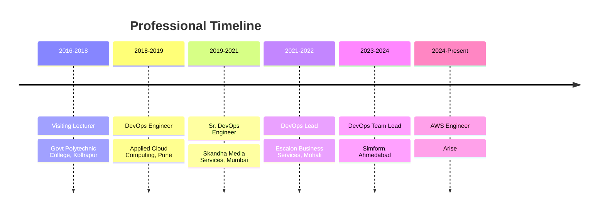

<p align="center">
  
</p>

<p align="center">
  <a href="https://www.linkedin.com/in/amitbarate/"></a>
  <a href="mailto:akb0103.official@gmail.com"></a>
  <a href="https://github.com/AmitBarate07"></a>
  
</p>

---

## 🚀 About Me

```yaml
Name: Amit Barate
Role: AWS Engineer @ Arise | Solutions Architect | Cloud Migration Specialist
Experience: 7+ Years in Cloud & DevOps
Location: Pune, India
Workloads Migrated: 100+
Downtime Achieved: Near Zero
Current Focus: Enterprise Cloud Migration & Transformation on AWS
```

- ☁️ Migrated **100+ workloads** across multiple waves with zero data loss
- 🏗️ Designing hybrid cloud architectures (Direct Connect, VPN, Transit Gateway)
- 🔧 Automating infrastructure using **Terraform, CloudFormation & AWS CDK**
- 🚀 Building robust **CI/CD pipelines** for faster and safer releases
- 📊 Driving reliability through **monitoring, autoscaling & observability**
- 💡 Helping enterprises with **IT transformation & cloud adoption strategies**

---

## 📋 Professional Summary

> 13 years' professional experience, including 7 years in IT (since Sept 2018)

| Domain | Expertise |
|--------|-----------|
| **Leadership & Consulting** | Guided enterprises in IT transformation, facilitated stakeholder workshops, built migration business cases (TCO, ROI, risk assessments), and trained teams on AWS best practices |
| **Cloud Migration** | Migrated 100+ workloads with zero data loss & minimal downtime; skilled in Rehost, Replatform, Refactor, Retire, and Retain strategies |
| **Solutions Architecture** | Helped companies transform IT infrastructure, operations & applications for scalability, innovation, and cost efficiency on AWS |
| **AWS & OCI Services** | Hands-on with VPC, EC2, RDS, IAM, S3, CloudWatch, CloudFormation, Route53, ECS, Lambda, CloudFront, Control Tower, Cloud9, OCI Functions |
| **Infrastructure & Architecture** | Designed hybrid cloud architectures (Direct Connect, VPN, Transit Gateway), scalable microservices, highly available stateful/stateless systems |
| **Database Migrations** | Oracle → Aurora, SQL Server → RDS, MongoDB → DocumentDB, with schema conversion using AWS SCT |
| **Automation & DevOps** | Infrastructure automation with Terraform, AWS CDK, CloudFormation; CI/CD with AWS SAM; config management with Ansible; scripting with Bash, Python, Lambda |
| **Monitoring & Security** | Best practices with ELK, Nagios, Zabbix, New Relic; hardened Apache, Nginx, MySQL for enhanced security |
| **Consulting Engagements** | Served on-site for major financial services organizations to optimize cloud infrastructure, conduct training, and drive cloud adoption |
| **Cost Optimization** | Delivered measurable savings through AWS infrastructure tuning and workload right-sizing |

### Additional Accomplishments

- 🐳 Designed and deployed microservice architectures leveraging AWS Lambda and container platforms (Docker, ECS)
- 🎬 Automated transcoding workflows with AWS Media Converter
- 📺 **VOD Automation in Media:** Built end-to-end Video-on-Demand (VOD) pipelines using AWS MediaConvert, S3, Lambda, and CloudFront for automated ingestion, transcoding (CBR, VBR, QVBR), packaging, and delivery of media assets at scale
- ⚡ Delivered serverless CI/CD pipelines, reducing deployment time and operational overhead
- 📡 Deployed live channels and serverless automation on Oracle Cloud Infrastructure
- 🔍 Conducted OS-level troubleshooting and debugging to resolve production-critical issues

---

## 🛠️ Tech Stack

<table>
<tr>
<td align="center" width="20%">

**Cloud & Migration**

</td>
<td>


</td>
</tr>
<tr>
<td align="center">

**IaC & Automation**

</td>
<td>


</td>
</tr>
<tr>
<td align="center">

**Containers & Serverless**

</td>
<td>


</td>
</tr>
<tr>
<td align="center">

**CI/CD & DevOps**

</td>
<td>


</td>
</tr>
<tr>
<td align="center">

**Monitoring**

</td>
<td>


</td>
</tr>
<tr>
<td align="center">

**Languages & OS**

</td>
<td>


</td>
</tr>
</table>

---

## 🏆 AWS Certifications

<p align="center">
  
  
  
  
</p>

---

## 💼 Career Journey




---

## � Featured Projects

| Project | Description | Tech Stack |
|---------|-------------|------------|
| [AWS-Migration-Playbook](https://github.com/AmitBarate07/AWS-Migration-Playbook) | End-to-end migration runbooks, wave planning, and cutover strategies | AWS MGN, DMS, SCT, Terraform |
| [VOD-Automation-Pipeline](https://github.com/AmitBarate07/VOD-Automation-Pipeline) | Serverless VOD pipeline with automated transcoding and CDN delivery | AWS MediaConvert, Lambda, S3, CloudFront |
| [Terraform-AWS-Infra](https://github.com/AmitBarate07/Terraform-AWS-Infra) | Reusable Terraform modules for production-ready AWS infrastructure | Terraform, VPC, EKS, RDS, IAM |
| [CI-CD-Pipelines](https://github.com/AmitBarate07/CI-CD-Pipelines) | CI/CD pipeline templates for containerized and serverless deployments | GitHub Actions, GitLab CI, CodeBuild |
| [Monitoring-Stack](https://github.com/AmitBarate07/Monitoring-Stack) | Centralized monitoring setup with alerting and dashboards | Prometheus, Grafana, ELK, CloudWatch |
| [Expense-Tracker](https://github.com/AmitBarate07/Expense-Tracker) | Personal expense tracking application with analytics and reporting | Python, Lambda, DynamoDB |
| [Skandha-TAMS](https://github.com/AmitBarate07/Skandha-TAMS) | Transcoding & Asset Management System for media workflows | AWS MediaConvert, S3, Lambda, Rekognition |
| [skandha-time-addressable-media-store-tools](https://github.com/AmitBarate07/skandha-time-addressable-media-store-tools) | Time-addressable media store tools for media management | TypeScript |
| [skandha-time-addressable-media-store](https://github.com/AmitBarate07/skandha-time-addressable-media-store) | Time-addressable media store backend service | Python |

---

## 📚 Learning & Notes

| Repository | Topic | Status |
|------------|-------|--------|
| [AWS-SA-Professional-Notes](https://github.com/AmitBarate07/AWS-SA-Professional-Notes) | AWS Solutions Architect Professional exam prep & notes | ✅ Completed |
| [Kubernetes-Learning](https://github.com/AmitBarate07/Kubernetes-Learning) | EKS, Helm, service mesh, and K8s patterns | 🔄 In Progress |
| [Terraform-Deep-Dive](https://github.com/AmitBarate07/Terraform-Deep-Dive) | Advanced Terraform patterns, modules, and state management | 🔄 In Progress |
| [Python-for-DevOps](https://github.com/AmitBarate07/Python-for-DevOps) | Boto3, Lambda functions, automation scripts | ✅ Completed |
| [Docker-and-Containers](https://github.com/AmitBarate07/Docker-and-Containers) | Dockerfile best practices, multi-stage builds, ECS/EKS deployment | ✅ Completed |

---

## 📊 GitHub Stats

<p align="center">
  
  
</p>

---

<p align="center">
  <i>💬 "Helping enterprises transform their infrastructure to be scalable, secure, and cost-efficient on the cloud."</i>
</p>

<p align="center">
  <b>Let's connect and build something great together! 🤝</b>
</p>
